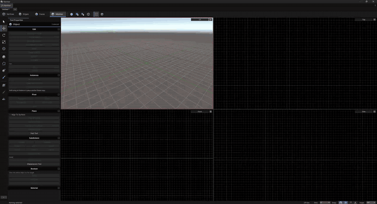
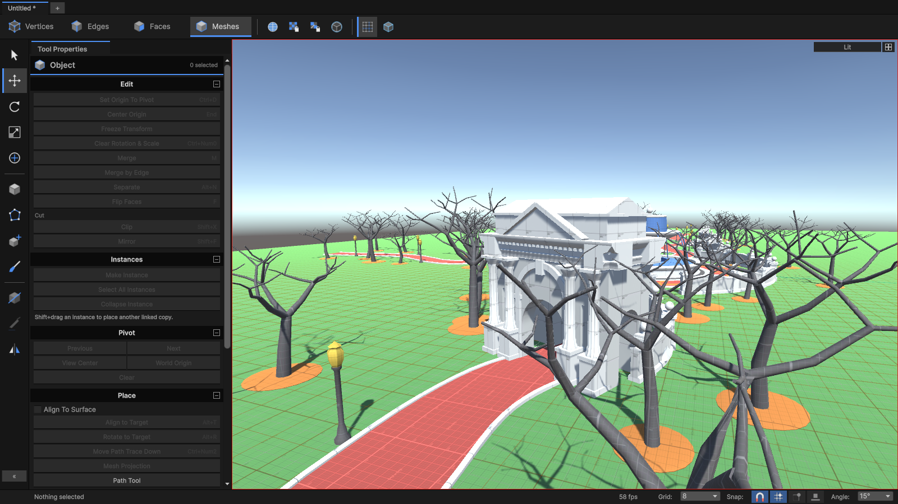
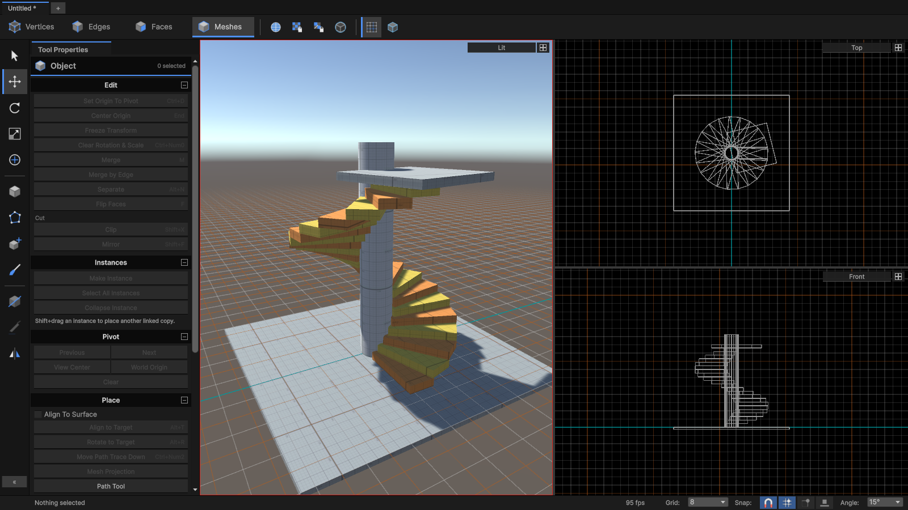
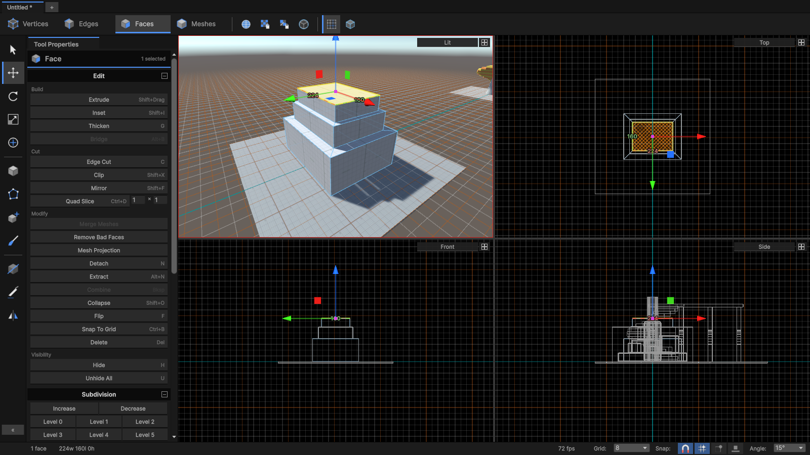
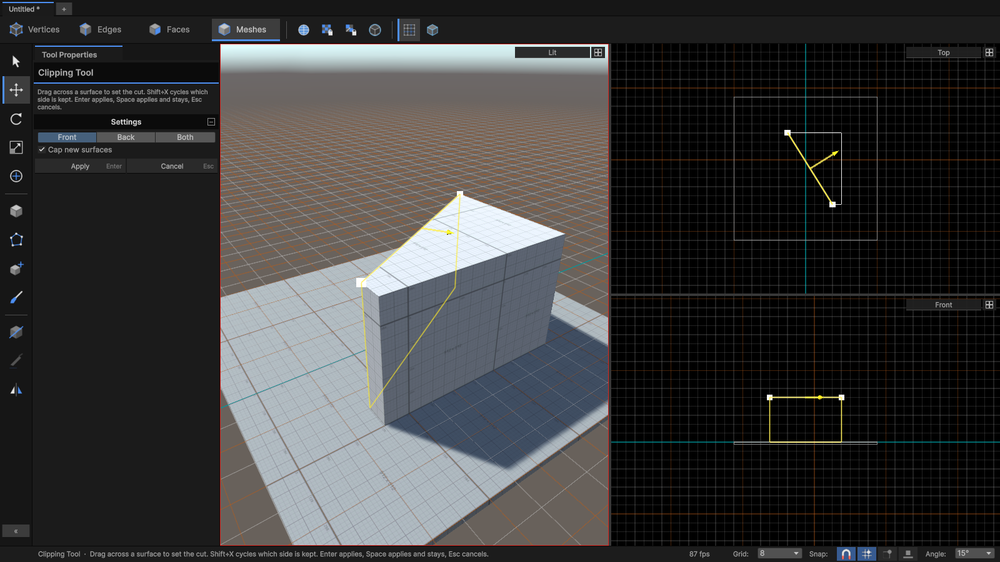
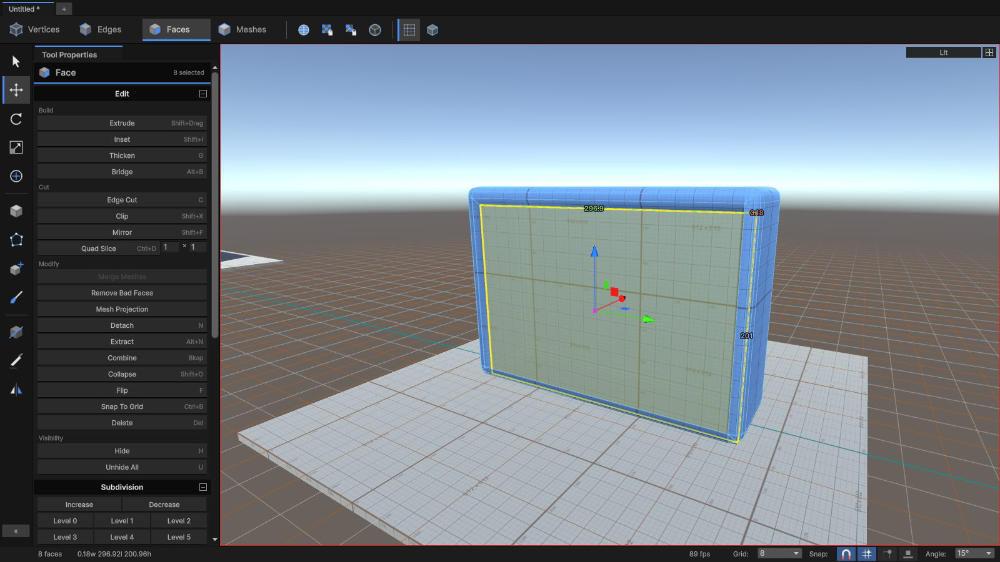
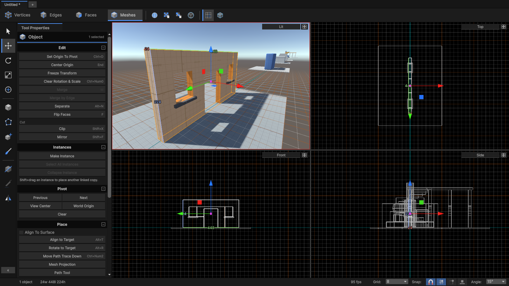
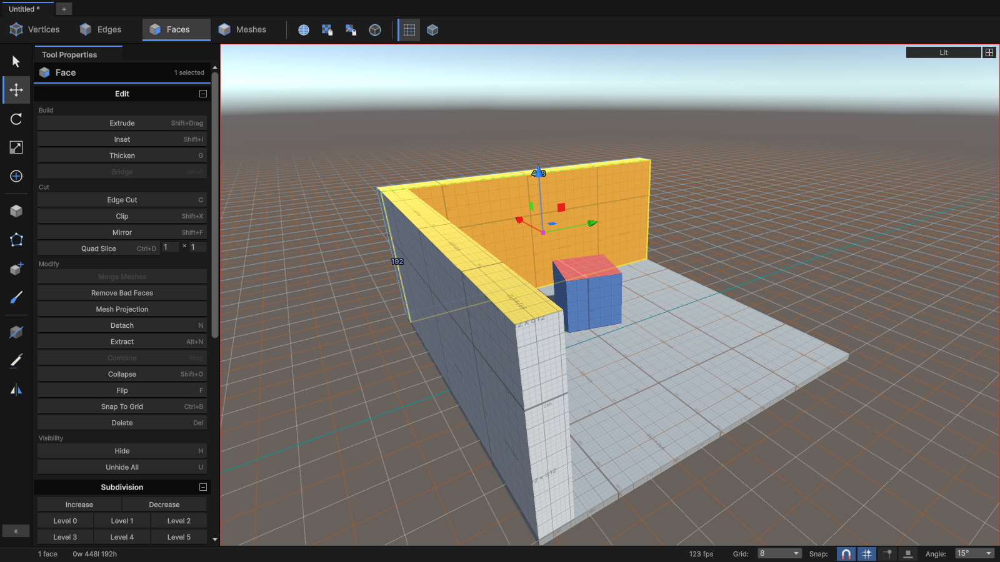
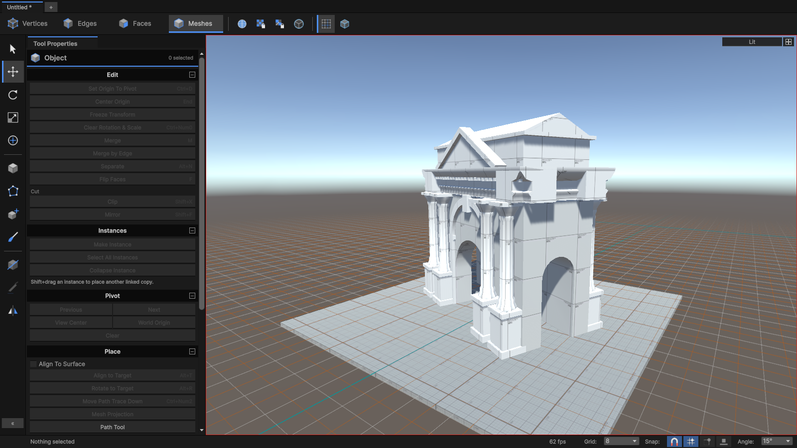

# Hammer Mesh Tools for Unity

Source 2 Hammer's mesh tools, right inside Unity. Block out a level, extrude some shapes, then
push, pull, cut and bevel to your heart's content. All the features you expect from Hammer,
without leaving Unity.

> **[BETA]** This is still in development: expect rough edges and bugs. If something breaks,
> please open an issue.

## Features

**Modelling**
- Edit vertices, edges, faces or whole meshes with move, rotate and scale gizmos
- Shift+drag to extrude; inset, bevel, thicken and quad slice
- Edge cut (knife), bridge, edge arch, path extrude, connect, collapse and fill hole
- Clipping and mirror tools
- Boolean union, subtract and intersect

**Shapes**
- Block, cylinder, sphere, stairs, doorway and arch, spike and quad
- Polygon tool: click out any outline and give it height

**Selection and placing**
- Click, box and lasso selection; loops, rings, grow and shrink, faces on the same plane
- Pivots (Insert, or hold Tab and click), workplanes, world or local axes
- Grid, vertex and surface snapping

**Texturing**
- World-aligned texturing, the Fast Texture tool, shift, scale and rotate, texture lock
- Pick up and paint materials; Hammer's dev textures included
- Vertex paint and displacement sculpting

**Workflow**
- Hammer's four views, keys and camera controls
- Repeat last (Shift+G), selection sets, command history, Outliner and Object Properties
- Hide faces, mesh health checks, and undo for everything
- A tutorial map that follows Valve's docs

## Install

1. Requires **Unity 6**.
2. Open **Window > Package Manager**, click **+**, choose **Add package from disk…** and pick
   this folder's `package.json`. You can also copy the folder into your project's `Packages/`
   folder.

## The basics

Open the editor with **Window > Hammer** (Ctrl+Shift+H). It has four views: 3D, Top, Front and
Side. The **Tool Properties** panel for whatever you're doing sits beside them.

1. **Draw a block**: press Shift+B and drag in any view.
2. **Pick what to edit** with the buttons at the top, or with 1–4: **Vertices**, **Edges**,
   **Faces** or whole **Meshes**.
3. **Select** by clicking or dragging a box around things. A middle-drag selects with a lasso.
4. **Change it**: drag the gizmo to move, rotate or scale. **Hold Shift while you drag** to
   extrude (pull new geometry out of a face or edge).
5. Use the Tool Properties panel for everything else, such as bevel, inset, clip, bridge and
   materials. Each button shows its shortcut.

Everything can be undone with Ctrl+Z. To learn the tools step by step, use
**Tools > Hammer > Build Tutorial Map**. It builds a walkthrough level with one room per topic.

## Screenshots

<table>
  <tr>
    <td></td>
    <td></td>
  </tr>
  <tr>
    <td></td>
    <td></td>
  </tr>
  <tr>
    <td></td>
    <td></td>
  </tr>
  <tr>
    <td></td>
    <td></td>
  </tr>
</table>

## Learning the tools

Valve's [Source 2 level design docs](https://developer.valvesoftware.com/wiki/Source_2/Docs/Level_Design)
are the best way to learn how everything works: Navigation, Hammer Overview, Mesh Editing 1 to 4,
Mesh Texturing and Creating Your First Room. Almost all of it carries over. The keys, modes and
tools match, though a few things work a little differently in Unity (materials, prefabs,
visibility). The tutorial map follows the same chapters, in the same order.

## Moving around

| | 3D view | 2D views |
| --- | --- | --- |
| Look / fly | Hold right mouse, then WASD, with Z / X for up and down (Shift is faster) | – |
| Orbit | Alt + left drag | – |
| Pan | Alt + middle drag | Right drag |
| Zoom | Mouse wheel, or Alt + right drag | Mouse wheel |
| Frame the selection | Shift+A | Shift+A |

Mouse buttons 4 and 5 change the grid size. F2–F6 switch the view under the mouse to Top,
Front, Side, 3D Fullbright or 3D Lit.

## Main keys

These keys work while the Hammer window is focused. To change any of them, go to
**Edit > Shortcuts > Hammer**. Press **F1** in the window to see the full list.

| Key | Action |
| --- | --- |
| 1 / 2 / 3 / 4 | Vertex / Edge / Face / Mesh mode |
| T / R / E | Move / Rotate / Scale |
| Shift+drag | Extrude |
| Tab | Switch between world and local axes. Hold it and click to place the pivot |
| [ / ] | Smaller / larger grid |
| Ctrl (while dragging) | Turn grid snapping off or on |
| Shift+B / Shift+P | Draw a block / draw a polygon |
| Shift+X / Shift+F | Clip / Mirror |
| C | Cut edges (knife) |
| F | Bevel (vertices, edges) · Flip (faces) |
| Shift+I | Inset faces |
| Alt+B | Bridge |
| H / U | Hide / unhide faces |
| Shift+T | Apply the active material |
| Shift / Ctrl + right-click | Pick up / paint a material |
| Shift+G | Repeat the last action |
| Delete | Delete |

## Important

- **Units**: 1 unit = 1 inch, as in Hammer. A 128-unit block is about 3.25 m in Unity.
- **Dev textures**: you'll find Hammer-style measurement and grey materials under Material >
  Dev textures in Tool Properties.
- **Broken faces** (folded, bent or zero-size) are outlined in red. **Mesh Health** in Tool
  Properties fixes them.
- **Hidden faces** stay hidden in the editor only. Builds always include them.

## Not ported yet

- Hotspot texturing.
- UV unwrapping. Hammer's LSCM unwrap is replaced by a planar projection here.
- Select path and select similar.
- Shear, and cable tools.

## Credits and license

MIT. The mesh core (`Runtime/Sandbox`) is ported from the s&box mesh editor by Facepunch
Studios ([sbox-public](https://github.com/Facepunch/sbox-public), MIT). The Unity editor tools
are new code modelled on the s&box tools. See [LICENSE.md](LICENSE.md).
